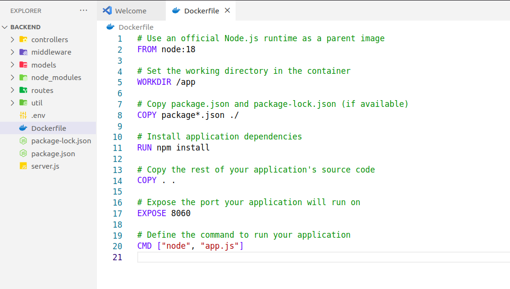
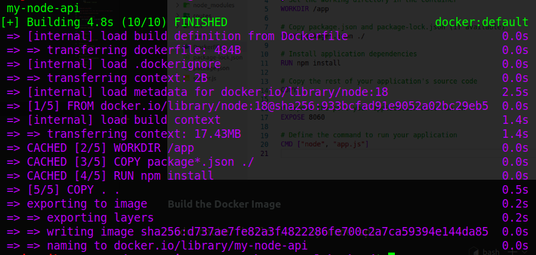
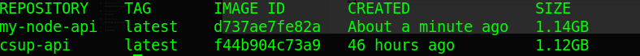
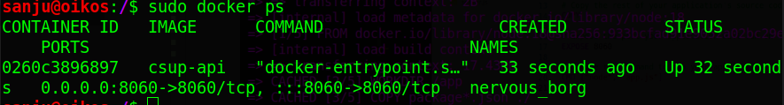
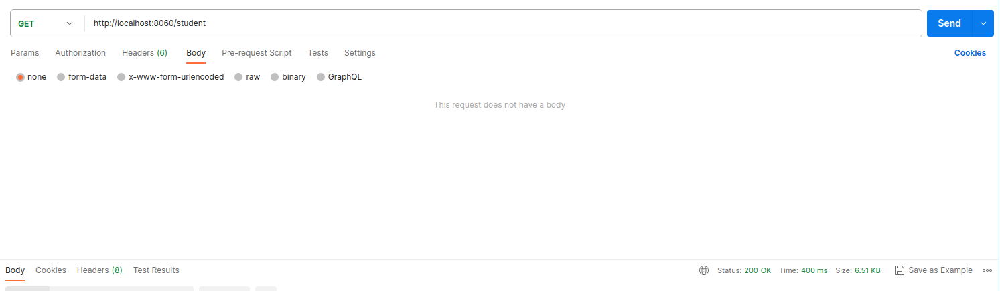

# End-to-end DevOps Project

## Table of Contents

1. [Project Overview](#project-overview)
   - Description of the project's purpose and goals.
2. [Prerequisites](#prerequisites)

   - Requirements for running and deploying the project.

3. [Dockerization](#dockerization)
   - Building Docker images and running containers.
4. [Kubernetes Deployment](#kubernetes-deployment)
   - Deploying the application to a Kubernetes cluster.
5. [CI/CD Pipeline](#ci-cd-pipeline)
   - Details of the Continuous Integration/Continuous Deployment pipeline.
6. [Infrastructure as Code (IaC)](#infrastructure-as-code-iac)
   - Provisioning and managing cloud infrastructure with IaC tools.
7. [Monitoring and Logging](#monitoring-and-logging)
   - How the application and infrastructure are monitored, including logs and metrics.
8. [Security](#security)

   - Security measures implemented, access controls, and best practices.

9. [Scaling and High Availability](#scaling-and-high-availability)

   - Design for scalability and high availability.

10. [References](#references)
    - External documentation and resources.

<br/><br/><br/><br/>

## Project Overview

\
Welcome to the DevOps Project Documentation! This comprehensive guide provides detailed insights into a dynamic DevOps project that leverages modern cloud technologies, containerization, CI/CD pipelines, and Infrastructure as Code (IaC) practices.

\
**Cloud-Centric Approach:**
\
Explore how this project harnesses the power of leading cloud providers, such as AWS, Azure, or GCP, to deploy scalable and resilient applications.

\
**Dockerization and Kubernetes:**
\
Dive into the world of containerization with Docker and learn how Kubernetes orchestrates containers for efficient application management.

\
**Continuous Integration/Continuous Deployment (CI/CD):**
\
 Discover how automated CI/CD pipelines streamline the development process, enabling rapid code integration, testing, and deployment.

\
**Infrastructure as Code (IaC):**
\
Delve into the realm of Infrastructure as Code (IaC) with tools like Terraform or CloudFormation, automating infrastructure provisioning and management.

\
**Security and Monitoring:**
\
Gain insights into the security measures in place and learn how monitoring and logging ensure the health and performance of deployed applications.

\
**Scalability and High Availability:**
\
Understand the project's design principles for scalability and high availability, ensuring optimal performance under varying workloads.

<br/><br/><br/>

## Prerequisites

- **Node.js Backend REST API:** I have developed the Node.js REST API already. You can find the project [here](https://github.com/sanjueranga/member-portal).

- **React Frontend:** I have developed the React frontend already. You can find the project [here](https://github.com/sanjueranga/member-portal).

<br/><br/><br/>

## Dockerization

> **Installing and Configuring Docker on Linux**

Follow these steps to install and configure Docker on your Linux machine. These instructions are generally applicable to popular Linux distributions like Ubuntu, CentOS, and Debian.

**Note:** Ensure that you have administrative (root) or sudo privileges on your Linux machine.

1.  **Update Package Lists:**

    Open a terminal and run the following command to update the package lists:

    ```bash
    sudo apt update  # For Ubuntu/Debian
    # or
    sudo yum update  # For CentOS
    ```

    Install dependencies that are required for the Docker installation:
    For Ubuntu/Debian:

    ```bash
    sudo apt install -y apt-transport-https ca-certificates curl software-properties-common

    ```

    Add Docker Repository (Ubuntu/Debian Only):

    For Ubuntu and Debian, add Docker's official GPG key and repository:

    ```bash

      curl -fsSL https://download.docker.com/linux/ubuntu/gpg | sudo gpg --dearmor -o /usr/share/keyrings/docker-archive-keyring.gpg

      echo "deb [signed-by=/usr/share/keyrings/docker-archive-keyring.gpg] https://download.docker.com/linux/ubuntu $(lsb_release -cs) stable" | sudo tee /etc/apt/sources.list.d/docker.list > /dev/null

    ```

    Install Docker Engine:

    Update the package list one more time and then install Docker:

    ```bash
      sudo apt update  # For Ubuntu/Debian
          # or
      sudo yum makecache fast  # For CentOS

      sudo apt install docker-ce  # For Ubuntu/Debian
          # or
      sudo yum install docker-ce  # For CentOS

    ```

    Enable and Start Docker:

    Start the Docker service and enable it to start on boot:

    ```bash
    sudo systemctl start docker
    sudo systemctl enable docker

    ```

    Verify Docker Installation:

    Check if Docker is installed and running by running the following command:

    ```bash
       sudo docker --version


    ```

> **Dockerizing API**

**Include docker file into root directory of Node app**

\


**Build the Docker Image**

```
sudo docker build . -t my-node-api
```

\


** Check created docker images**

```
docker images
```



you can see our docker image is created

**Run Docker Image**

```
docker run -p 8060:8060 -d my-node-api
```

we can add environment when running `docker run -e ALLOWED_URL=value -p 8060:8060 -d my-node-api`

**See running docker images**

`docker ps`

\


you can see image is currently running on port 8060

\
**Testing API with Postman**


API call works properly

**Stoping running container**

```
sudo docker stop  container-id
```

> **Dockerizing REACT frontend**

**Dockerfile**

```
# Use an official Node.js runtime as a parent image
FROM node:18

# Set the working directory in the container
WORKDIR /app

# Copy package.json and package-lock.json (if available)
COPY package*.json ./

# Install application dependencies
RUN npm install

# Copy the rest of your application's source code
COPY . .


# Build your React app
RUN npm run build

# Expose the port your React app will run on (usually 3000)
EXPOSE 3000

# Define the command to run your React app
CMD ["npm", "start"]
```

Dokcerignore file

```
.env
node_modules
```

**To create the Docker Image**
use the same command as above
`sudo docker build . -t my-react-app`

**To Run**

```
sudo docker run -e REACT_APP_API_URL=http://localhost:8060 -e REACT_APP_API_KEY=value -p 3000:3000 my-react-app

```

Now we can see the both frontend and backend running as docker images.

**Make sure allowing correct URLs in CORS in node environments**

**Here an additional bash script to clear all containers after test**

```bash
#!/bin/bash

# Get a list of all containers (both running and exited)
container_list=$(docker ps -aq)

# Check if there are any containers to stop and remove
if [ -n "$container_list" ]; then
  # Iterate through each container ID, stop it, and then remove it
  for container_id in $container_list; do
    echo "Stopping container: $container_id"
    docker stop "$container_id"

    echo "Removing container: $container_id"
    docker rm "$container_id"
  done
else
  echo "No containers to stop and remove."
fi

```

<br/><br/><br/>

## Kubernetes Deployment

...
<br/><br/><br/>

## CI/CD Pipeline

...
<br/><br/><br/>

## Infrastructure as Code (IaC)

...
<br/><br/><br/>

## Monitoring and Logging

...
<br/><br/><br/>

## Security

...
<br/><br/><br/>

## Scaling and High Availability

...
<br/><br/><br/>

## References

...
