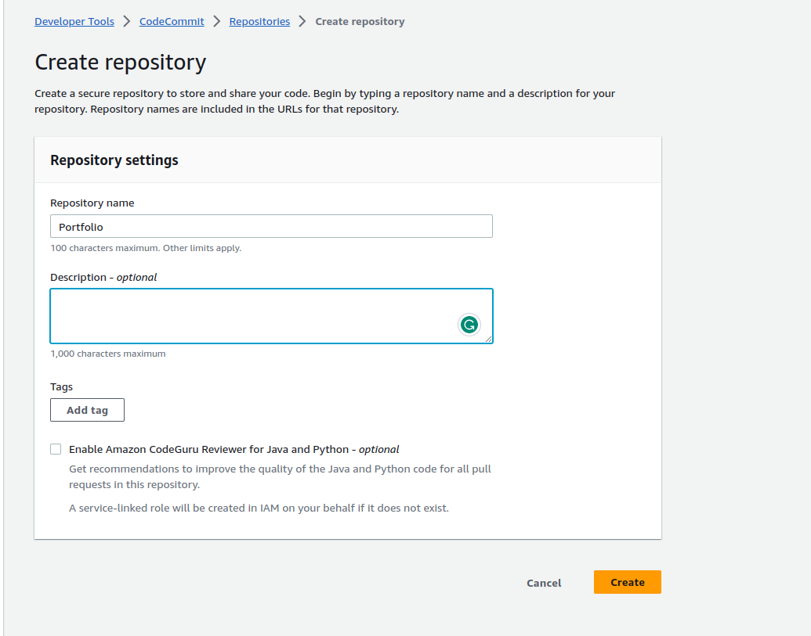
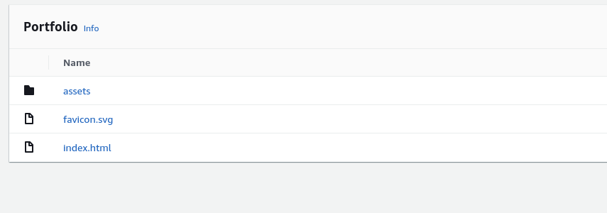
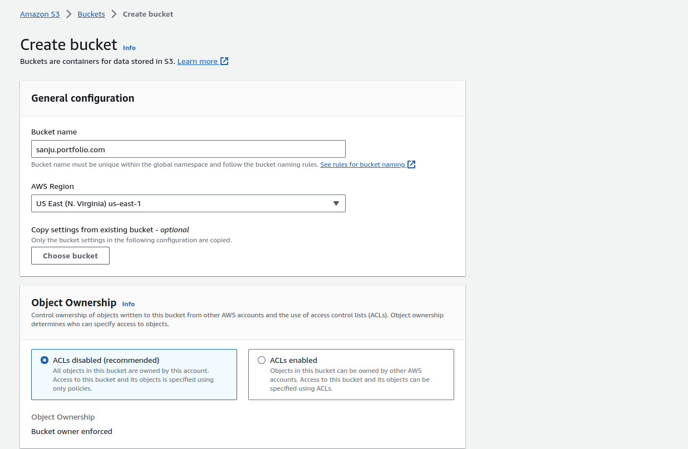
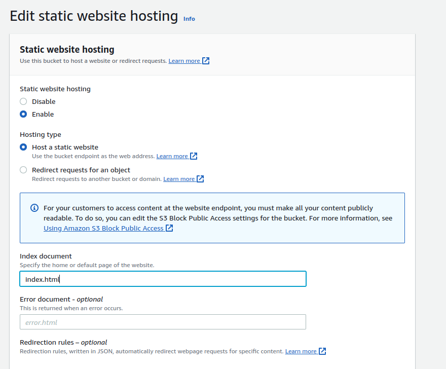
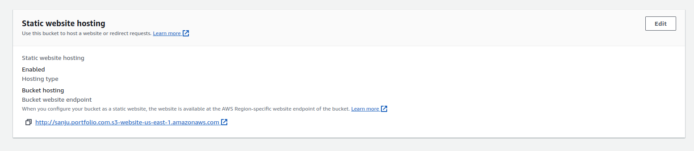
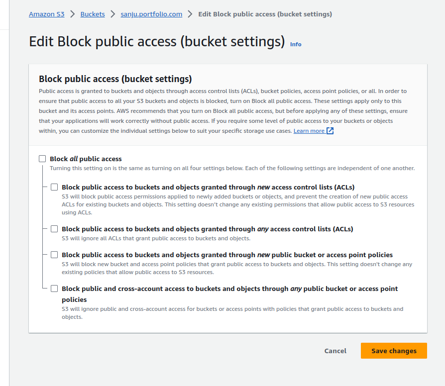
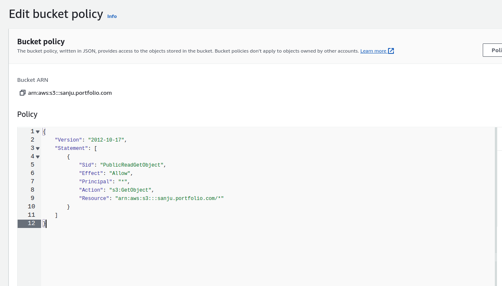
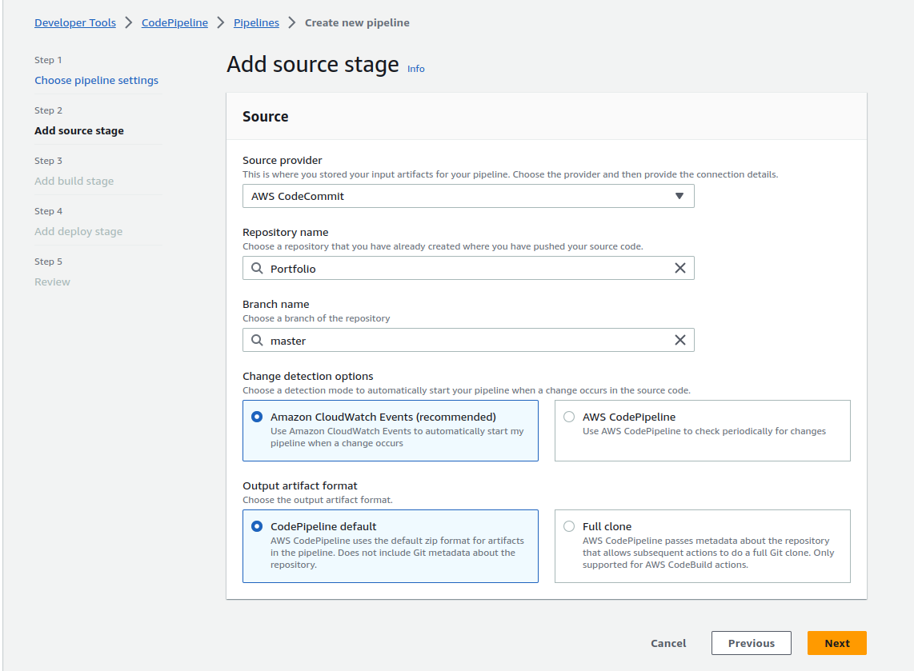
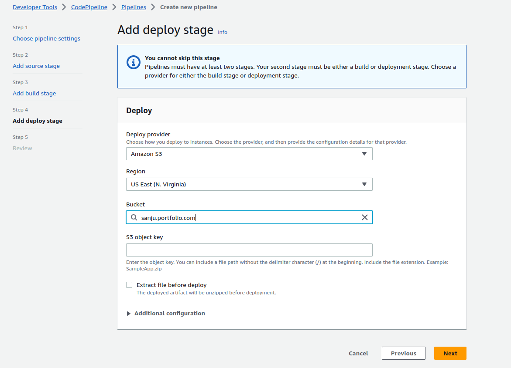
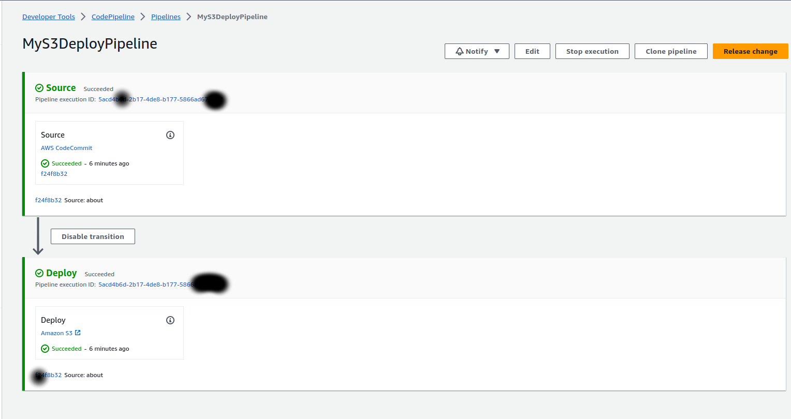

# Pipeline Demo

## Hosting a static website using Amazon S3

I have use 3 aws services here,
codecommit,pipeline,S3 buckets.
All are free-tier eligible and free of charge


> ## Step 1 :

> **create a codecomit repository**



> **Create IAM user for code commit operations**

    Asign following permissons


So that the IAM user can commit to this codecommit repo.


> ## Step 2 :
>
> **Connect codecommit repository to local repository.**

Method 1
clone the repository

```
git clone https://git-codecommit.us-east-2.amazonaws.com/v1/repos/MyDemoRepo my-demo-repo
```

Method 2

connect local repo using ` git add remote`

```
git remote add origin https://git-codecommit.us-east-2.amazonaws.com/v1/repos/MyDemoRepo
```


> ## Step 3 :
>
> **pushing local files**

add, commit , push local files in to the codecommit repo.
it should finally show files ( you have to login using IAM user credentials which has permisson for codecommit)




## Step 4 :

> **Create a S3 bucket**

**Go to S3 bucket console**
(using S3 allowed IAM user or root user) and create a bucket



**Enable static hosting**
Go to properties , here we should select index document



    we can see our url of the site under static site settings



**Allow access for public users**

Since we are hosting a static site it should be visble to public



**Change bucket policy**

We have to add a bucket policy in order to bucket avalible for public access




> ## Step 5
>
> **Creating the code PipeLine**

**select source**

    Here we select our codecommmit repository as the source of this S3 bucket



**We skip build step for now**

**Deploy stage**

Here we add our deploy stage,
We select the S3 bucket we created



Now we create the pipeline

> ## Final Step:
>
> **Now we can pipeline is created and connected successfully**



** We can check the site using the link under static hosting**
