# Serverless REST API with AWS lambda + APIgateway + DynamoDB

## Table of Contents

1. [Project Overview](#project-overview)
   - Description of the project's purpose and goals.
2. [Prerequisites](#prerequisites)

   - Requirements for running and deploying the project.

3. [AWS Lambda](#aws-lambda)

   - Creating the req/res handler for the api using python on aws lambda.

4. [AWS api gateway](#apigateway)
   - Creating api end-points to execute lambda function using apigateway.
5. [Postman Tests](#postman-tests)
   - Testing api endpoints using postman

    

## Project-overview

In this project, we have developed a serverless RESTful API using AWS Lambda, API Gateway, and DynamoDB. These AWS services work together to create a scalable and efficient backend system for managing user data.

- When a client makes an HTTP request to our API Gateway endpoints, the requests are routed to the corresponding Lambda function.

- Lambda functions interact with DynamoDB to perform operations on user data, such as creating, retrieving, updating, or deleting records.
- Responses from Lambda functions are sent back through API Gateway to the client in the form of HTTP responses.
  The project ensures data integrity, security, and efficient handling of user-related operations in a serverless architecture.

**Benefits**

- Serverless architecture eliminates the need to manage infrastructure, resulting in cost-effectiveness.
  Scalability is handled by AWS services, automatically adapting to varying workloads.
- DynamoDB provides high availability and low-latency access to data.
- API Gateway secures and manages API endpoints, making it easy to expose services to clients.

  

## Prerequisites

- AWS account
- Postman
- DynamoDB table

  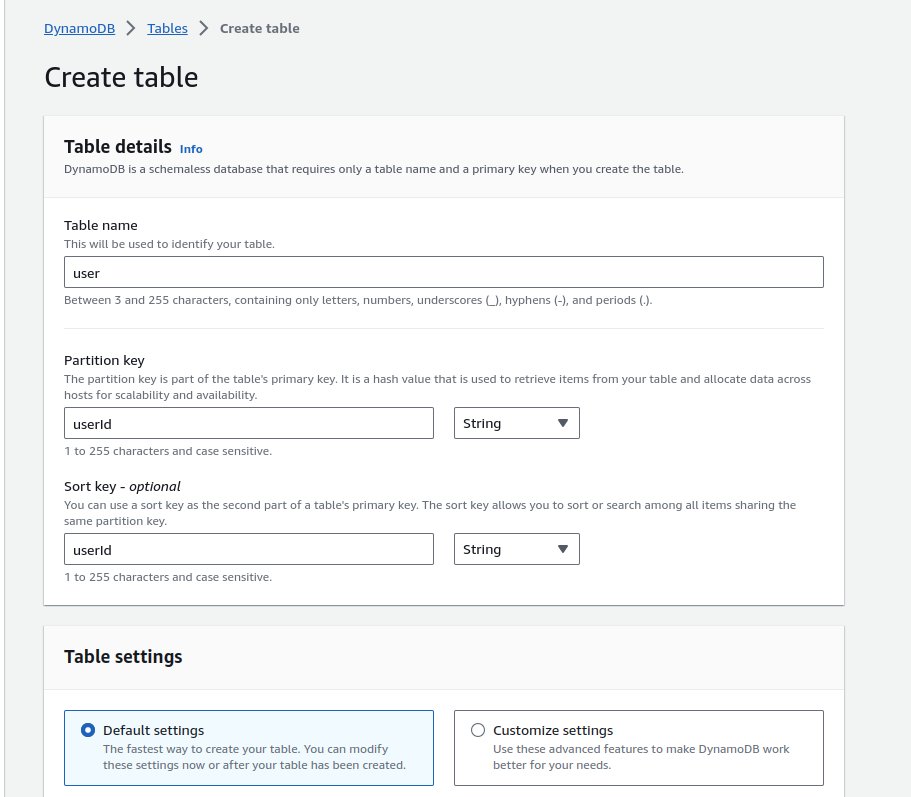

**IAM user with following poliecies**

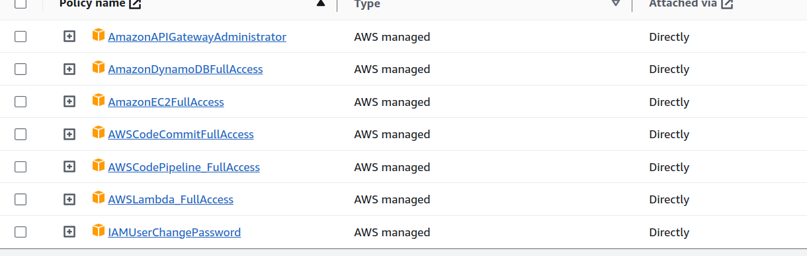

  

## AWS lambda

**Creating your first lambda function**

> Go to aws lambda console

- create new function

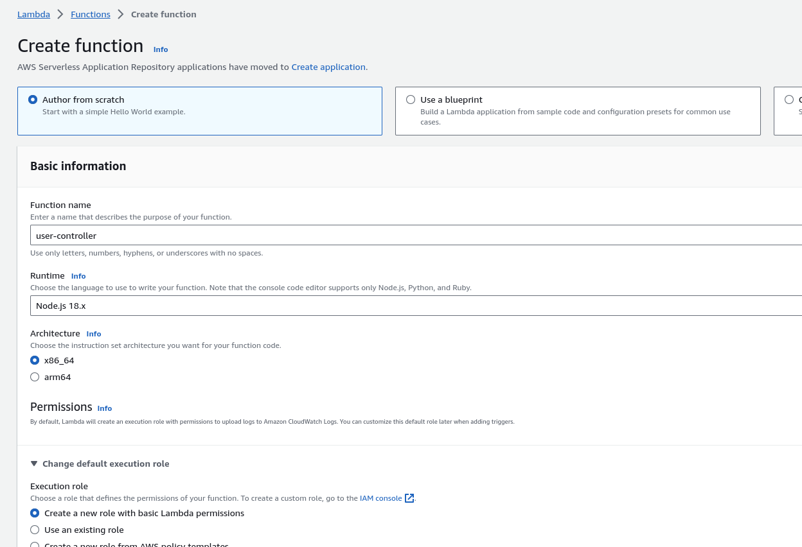

**Create a new role with lambda permissions**
And later allow dynmoDB fullAccess to that Role using IAM role configurations

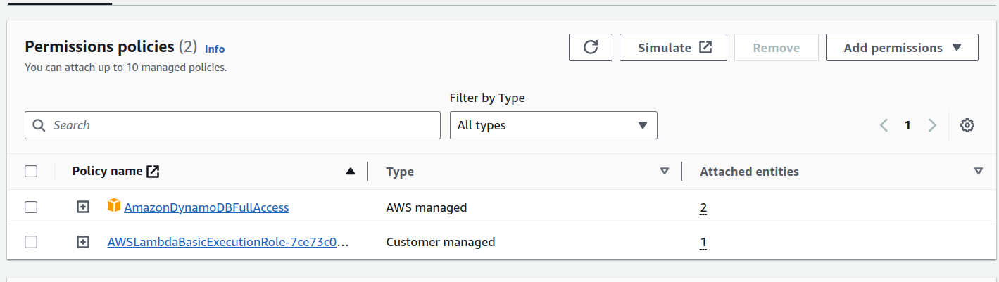

**Here we use name "user-controller" for the function name**

Here once the function is created

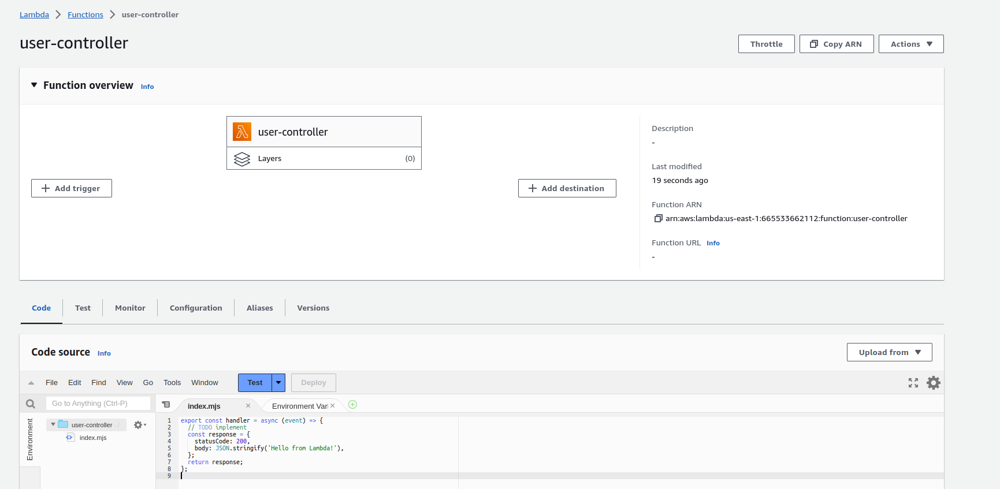

You can edit the code here.
And scroll down to edit the runtime envirnmont.
I created the function for node env, but changed it to python later.

and [here](./lambda_function.py) is my python script for this user controler.

It includes methods to help with GET,POST,DELETE,UPDATE and manage DB queries.

**we can create tiggers to connect api endpoint to the lambda function**

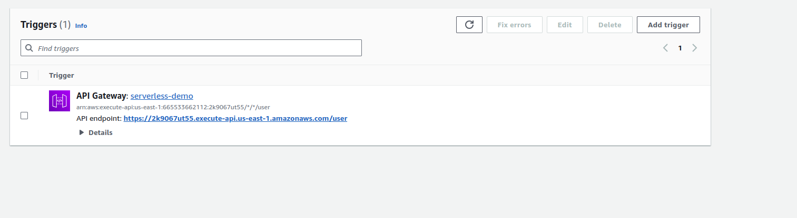

With the provided default lambda code, you can check if the server is running.

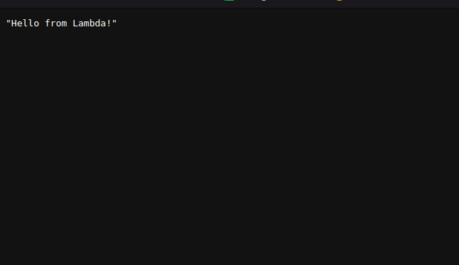

  

## APIgateway

> Go to api gateway console and create new api

(choose HTTP api)

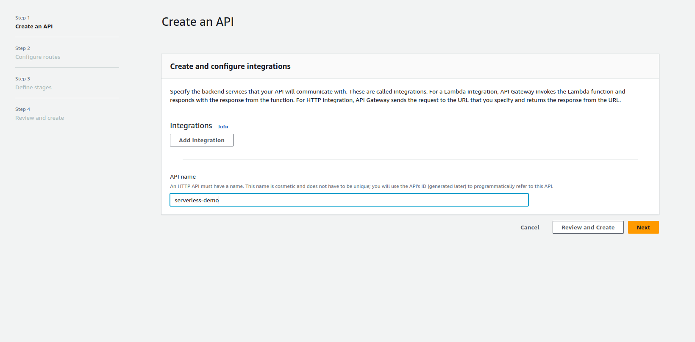

once created

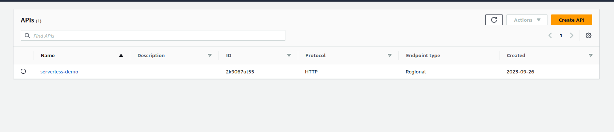

Now we add our routes/endpoints

> Go to create integrations

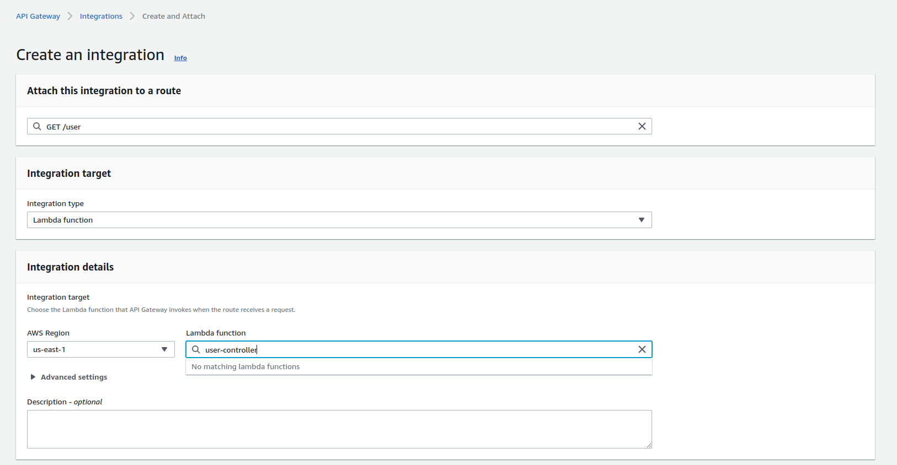

- select the route
- integration type : aws lambda
- and chose the function : user-controler

**Create all routes** and attach integration

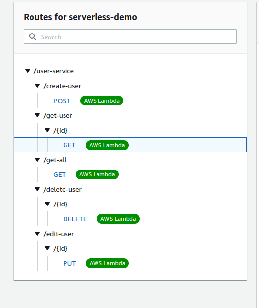

> Then in lambda console ,under tiggers we can see all the api endpoints

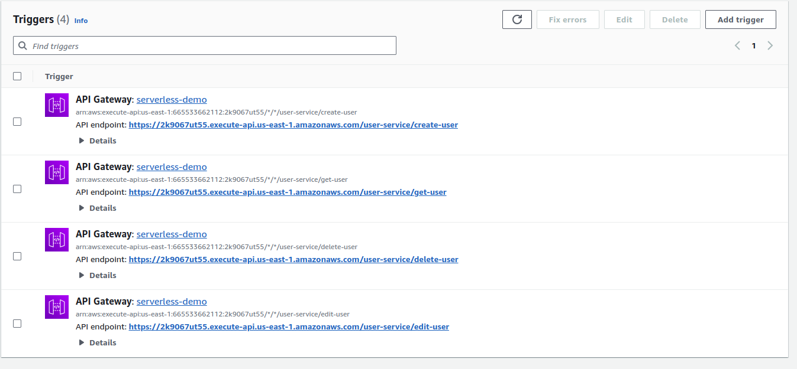

> **Allow CORS**

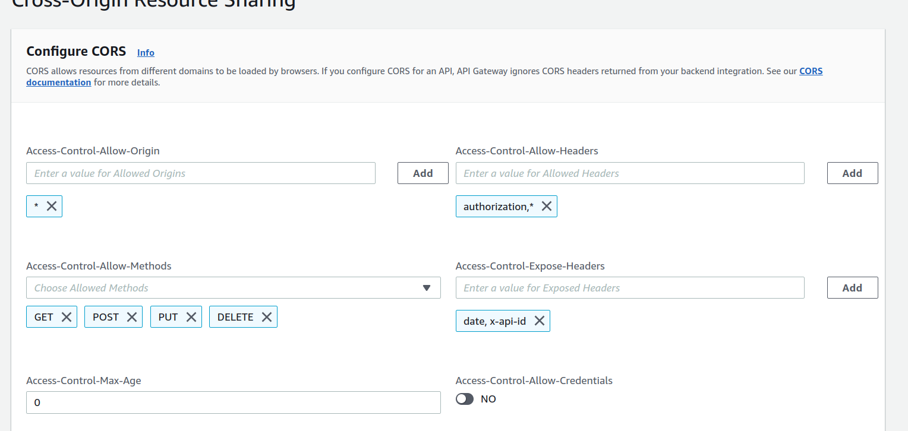

  

## Postman Tests

You can find the postman documentation [here](https://documenter.getpostman.com/view/27331759/2s9YJZ2PCL)

**Create a User**

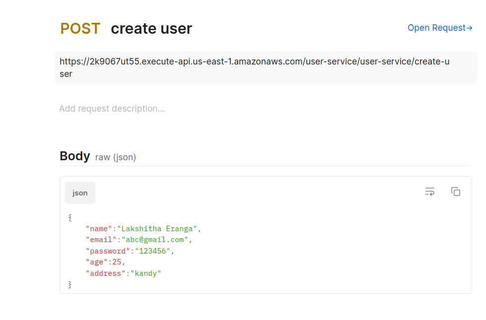

**Created user**

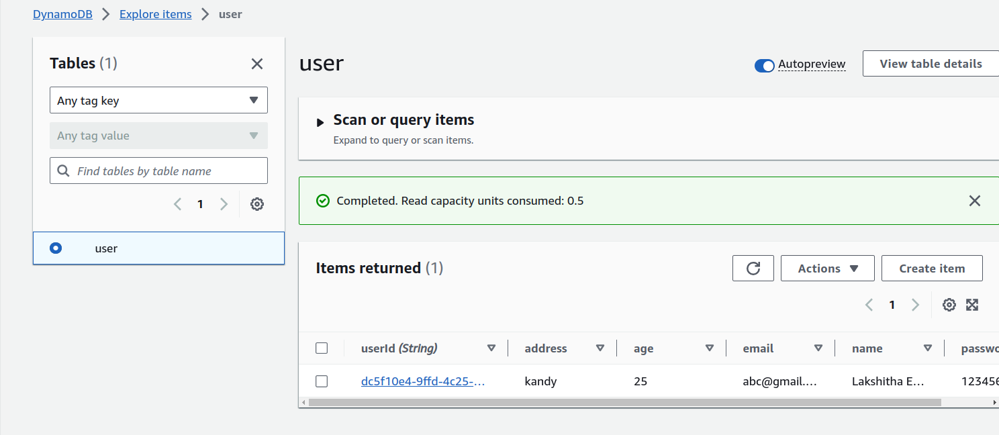

**Edit user**

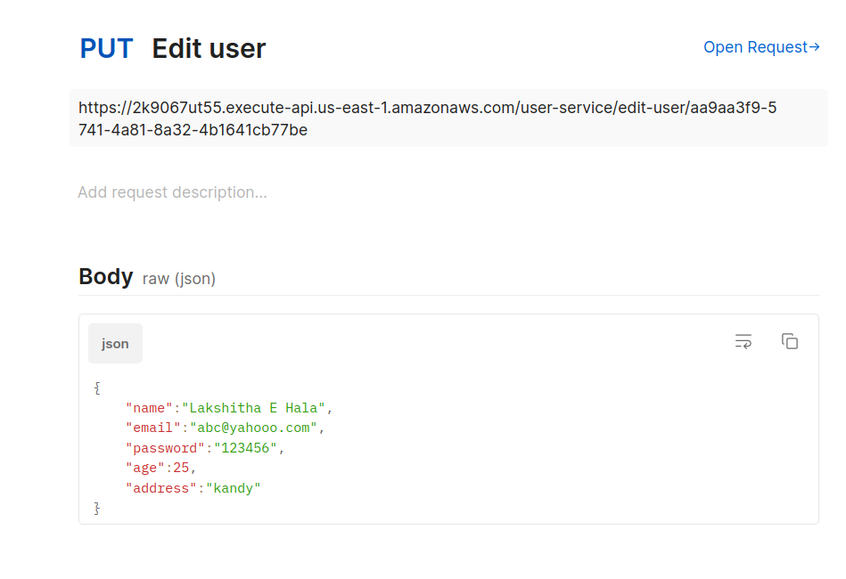
