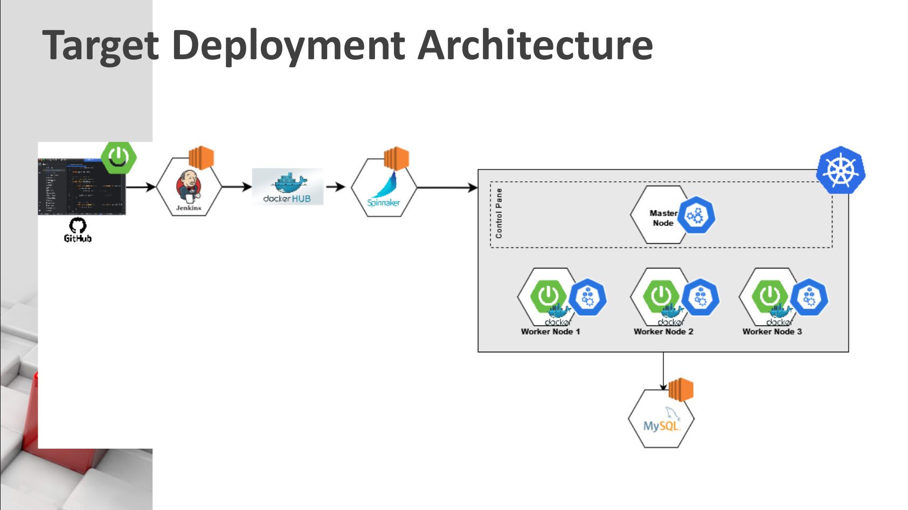
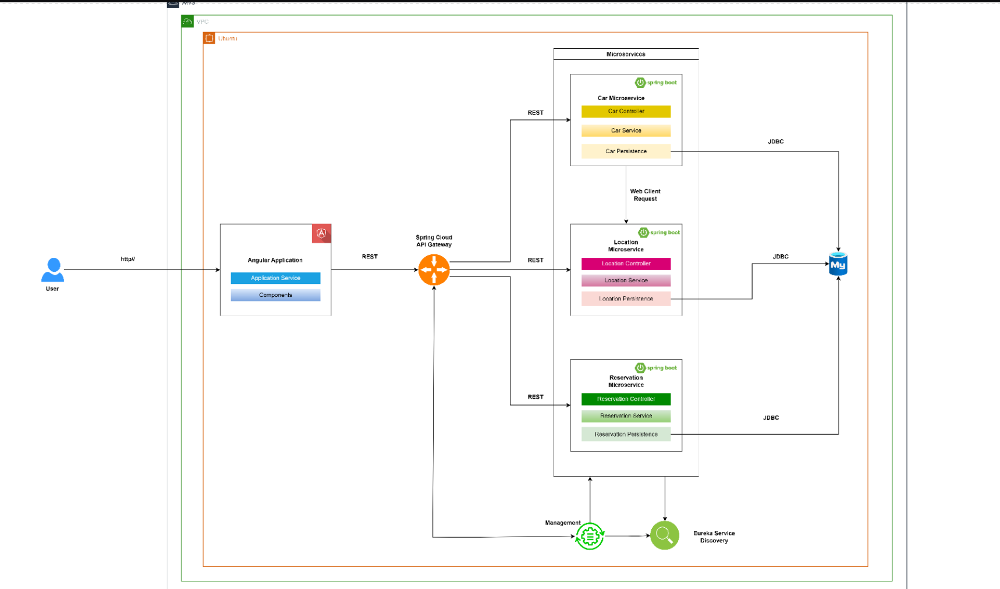
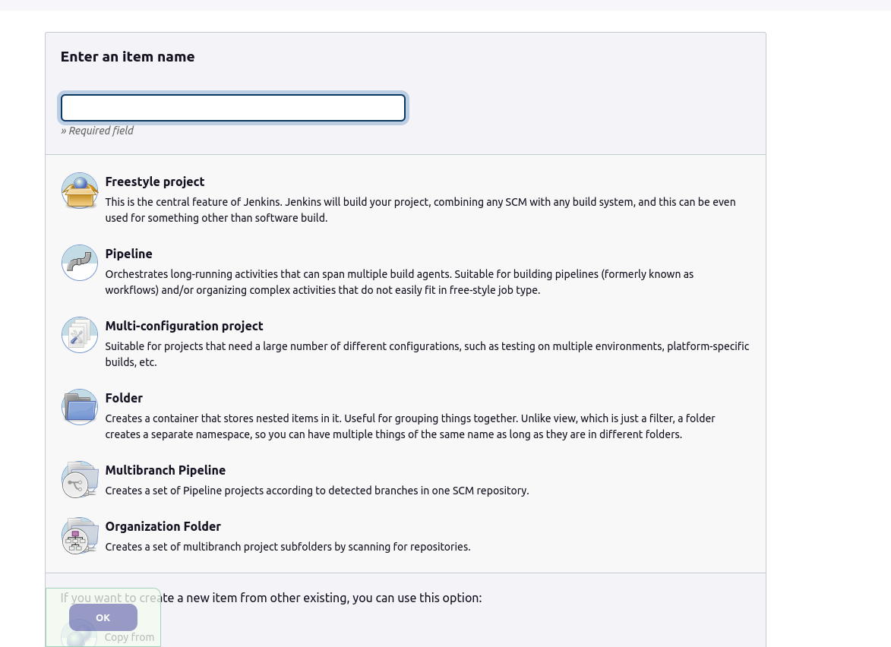
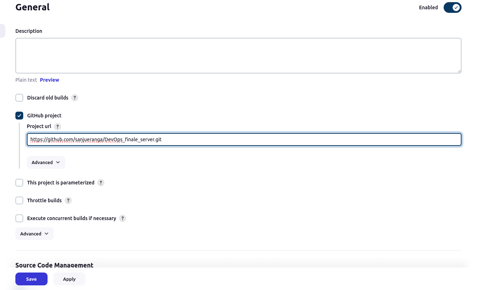
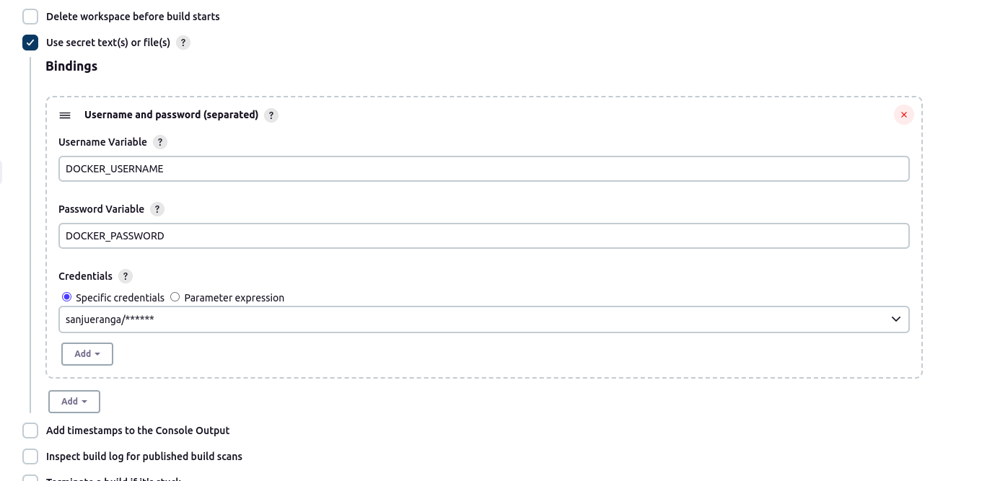
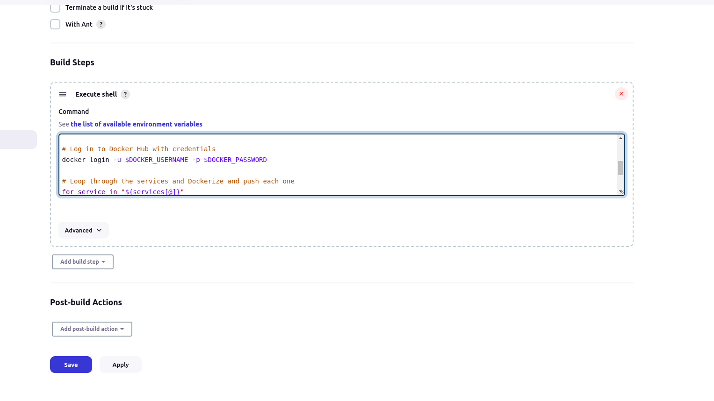
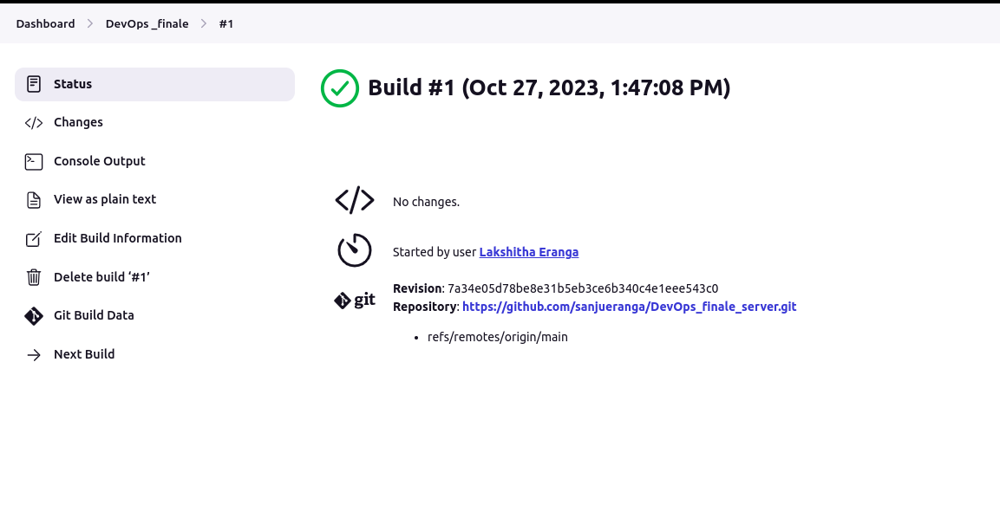
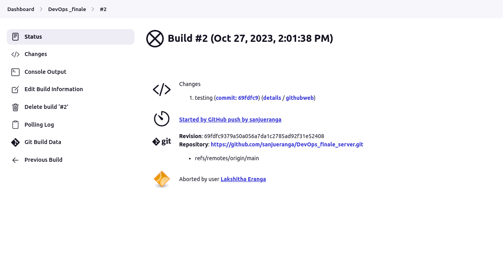
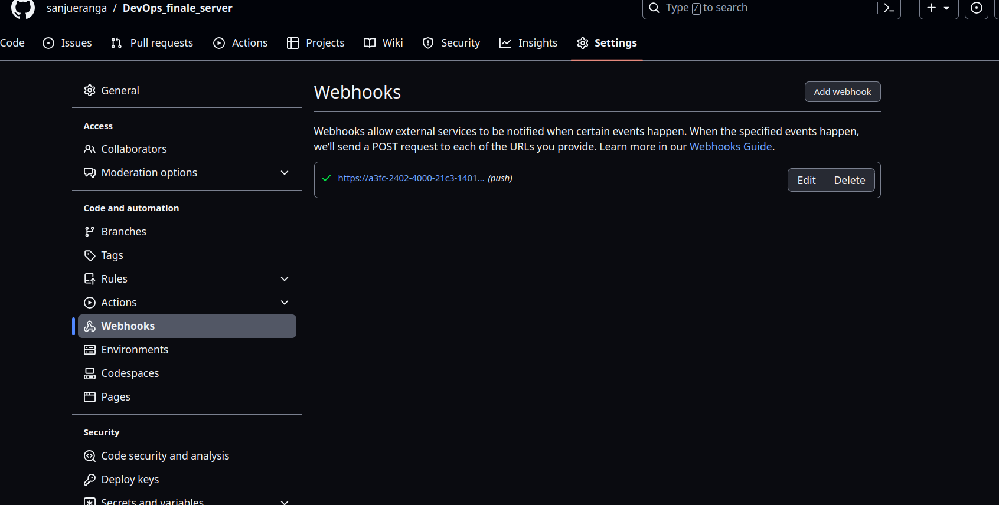

# End-to-End DevOps Project Documentation

## Table of Contents

1. [Project Overview](#project-overview)
   - Description of the project's purpose and goals.
2. [Prerequisites](#prerequisites)
   - Requirements for running and deploying the project.
3. [Setup Instructions](#setup-instructions)
   - How to set up the project locally or in your chosen environment.
4. [Jenkins Pipeline](#jenkins-pipeline)
   - Building Docker images and running containers.
5. [Spinnaker Pipeline](#spinnaker-pipeline)
   - Deploying the application to a Kubernetes cluster.

## Project Overview

Welcome to the DevOps Project Documentation! This comprehensive guide provides detailed insights into a dynamic DevOps project that leverages modern cloud technologies.

This is the overview of the full ci/cd pipeline

### [video demonstration]()



## Prerequisites

Before you dive into the DevOps project, make sure you have the following prerequisites in place:

### SpringBoot Microservices

- **three Microservices:** Ensure you have two Spring Boot microservices as part of your project.

- **Discovery Client:** Implement a discovery client to locate and interact with other services.

- **API Gateway:** Create an API gateway for routing and managing incoming requests.

For detailed information and the source code for these components, please visit [this GitHub repository](https://github.com/sanjueranga/DevOps_finale_server.git).

_Application Structure_



### Cloud Services

- Ensure access to cloud services like AWS, Google Cloud, or any other cloud platform where you plan to deploy your applications.

These prerequisites are essential for a smooth execution of the DevOps project. Make sure all components are set up and configured correctly before proceeding.

## Setup Instructions

### Kubernetes cluster

We need a kubernetes cluster with 3 worker nodes and one master node.
we have created this before . please visit [this](../k8s-on-ec2/)

### Database

Create and deploy a mysql server on a EC2 instance.

## Jenkins Pipeline

> _Install and configure jenkins in local machine_

```
sudo wget -O /usr/share/keyrings/jenkins-keyring.asc \
  https://pkg.jenkins.io/debian/jenkins.io-2023.key
echo deb [signed-by=/usr/share/keyrings/jenkins-keyring.asc] \
  https://pkg.jenkins.io/debian binary/ | sudo tee \
  /etc/apt/sources.list.d/jenkins.list > /dev/null
sudo apt-get update
sudo apt-get install jenkins

```

_Make sure you have java and maven versions which supports your spring app_

> Log in to jenkins

http://localhost:8080/ (by default)

> _create project_

Choose Freestyle Project and continue



> _Add github repository_



> _Add Docker credentials_
> First add them in to jenkins credentials and you can use here



> _shell script_

Here we add following script
which checks for all services in the directory and build maven.

```bash
services=("api-gateway" "discovery-service" "car-service" "reservation-service" "location-service")

# Build each service
for service in "${services[@]}"; do
    cd "$service"
    mvn clean package

    # Check for the generated JAR file in the service/target directory
    jar_file="$(find target -name "${service}-0.0.1-SNAPSHOT.jar")"

    if [ -z "$jar_file" ]; then
        echo "Error: Could not find the .jar file for $service with naming convention ${service}-0.0.1-SNAPSHOT.jar"
    else
        echo "$service build completed."
    fi


    cd ..
done


```

_This one dockerize and push all images to the docker hub_

```bash

# Docker Hub credentials

# Log in to Docker Hub with credentials
docker login -u $DOCKER_USERNAME -p $DOCKER_PASSWORD

# Loop through the services and Dockerize and push each one
for service in "${services[@]}"
do
    cd "$service"  # Change to the service directory

    # Dockerize the service
    docker build -t sanjueranga/"$service":latest .

    # Push the Docker image to Docker Hub
    docker push sanjueranga/"$service":latest

    echo "$service Dockerized and pushed to Docker Hub."

    cd ..  # Return to the project root directory
done


```



_Save and continue_

### Do the first build manually



### Now add changes to the codebase and commit

You can see the build started by git push



### Note -

To achieve that you need to add webhooks in github repository
Payload url is your jenkins url

But we cant add localhost:8080.

so we can use EC2 instances to deploy jenkins server

Here I use `ngrok` which provides load balancing and give me a public accessble url for my jenkins local server

```
ngrok http 8080
```



## Spinnaker Pipeline

(Describe the deployment process to a Kubernetes cluster)

## References

### CSUP - [code-to-cloud workshop](https://youtube.com/playlist?list=PLK1fnte3Gz-hUJwCjYRoHHZKbQcbPpj0n&si=qFl-bmOkpDwu2Y4E)
