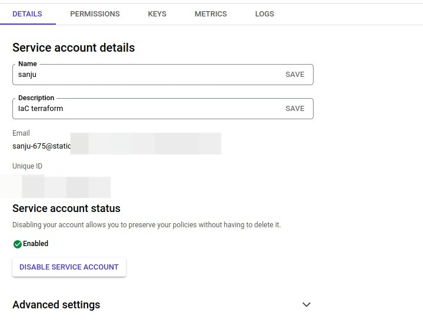
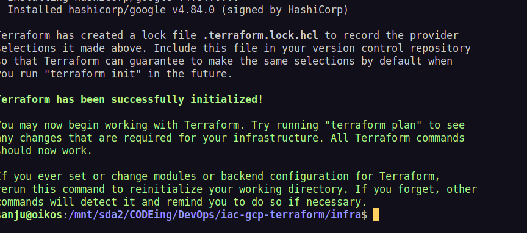
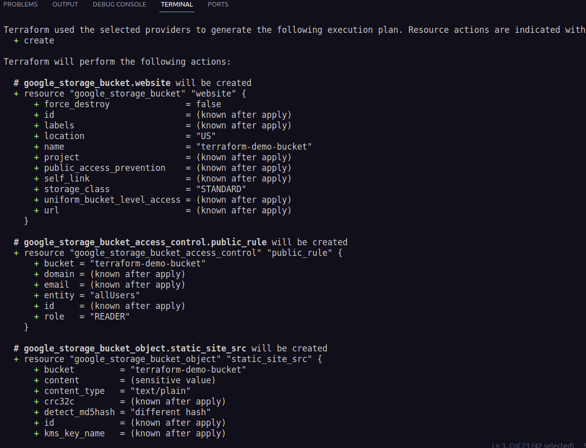
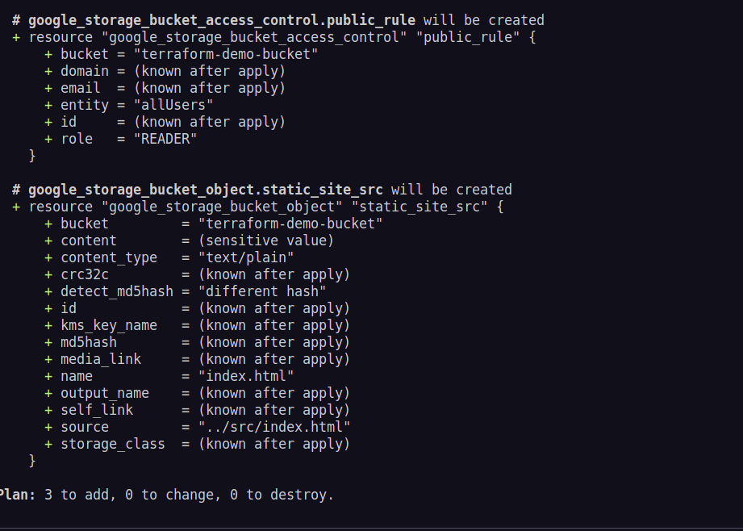
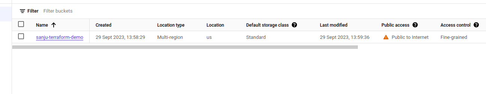
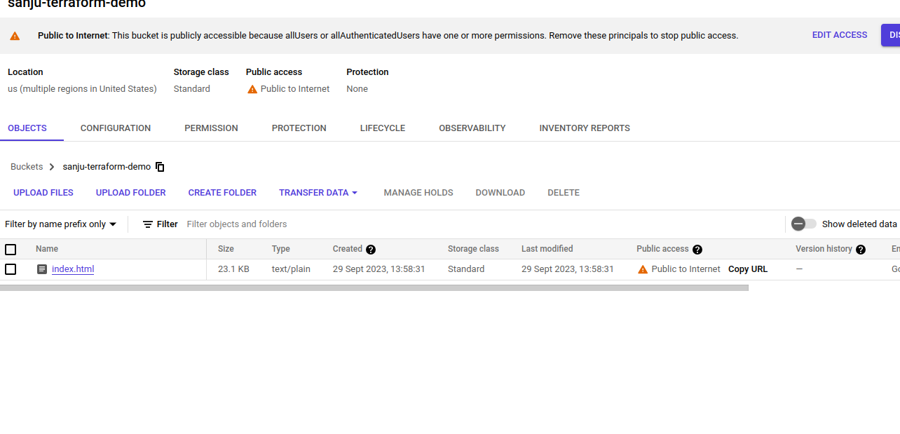

# IaC with Google Cloud and Terraform

## Table of Contents

1. [Project Overview](#project-overview)
   - Description of the project's purpose and goals.
2. [Prerequisites](#prerequisites)

   - Requirements for running and deploying the project.

3. [GCP Project Setup](#GCP-project-setup)

4. [Setup Infrastructure](#setup-infrastructure)

5. [Deploy](#deploy)

<br/><br/><br/><br/>

## Project Overview

Discover the power of Infrastructure as Code (IaC) in Google Cloud Platform (GCP) with Terraform. This project takes you through the process of provisioning and hosting a static website on GCP using Terraform scripts. Learn how to automate the creation of GCP resources, set up a scalable and cost-effective infrastructure, and deploy a static site.

<br/>

## Prerequisites

- Google cloud account linked to a billing account
- A Static web site

<br/>

## GCP Project Setup

- Create a new Project `Static Hosting`

> Go to Api and Services

And enable Followings ,

- Cloud DNS (if you have a custom domain name)
- Compute Engine
- IAM API

> Create Service Account

- Create an api key in JSON fomat



<br/>

> Install Terraform

[**Documentation**](https://developer.hashicorp.com/terraform/tutorials/aws-get-started/install-cli)

<br/>

## Setup Infrastructure

[Code](./infra/)

    mdir infra
    cd infra
    touch main.tf
    touch provider.tf

> Provider

```

    provider "google" {
    credentials = file(var.gcp_svc_key)
    project = var.gcp_project_id
    region = var.gcp_region

}

```

> **Create Bucket and make public**
> in [main.tf](./infra/main.tf)

```

resource "google_storage_bucket" "website" {
 name          = "terraform-demo-bucket"
 location      = "US"
}

#make bucket public

resource "gooogle-storage_object_access_contol" "public_rule"{
    object = google_storage_bucket.static_site_src.name
    bucket = google_storage_bucket.website.name
    role = "READER"
    entity = "allUsers"
}

```

> **Upload Content**

```

resource "google_storage_bucket_object" "static_site_src" {
 name         = "index.html"
 source       = "../src/index.html"
 content_type = "text/plain"
 bucket       = google_storage_bucket.website.name
}

```

**Declare varibles in [varible.tf](./infra/variable.tf)**

<br/>

## Deploy

in infra directory

```
terraform init

```



**`terraform plan`**





**To create resourcers** `terraform apply`

it will create the recourses,




