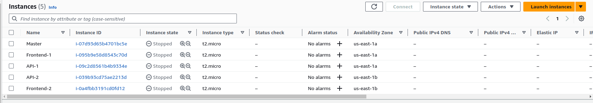
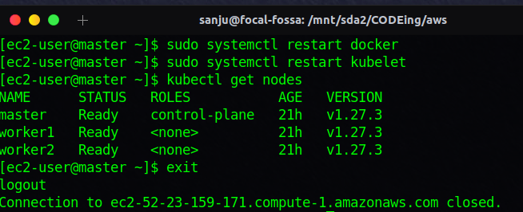

# Kubernetes on EC2

Here we are creating a k8 cluster manually with EC2 , instead of using EKS.

## Setting up AWS infrastructure

> **Creating EC2 instances**

**Creating Master Node( contorl pane)**

-we create a security group called launch-wizard-k8, which can be used for all EC2 instances in this k8 cluster. Only allow communication within security group.

And we will create another security group for frontend EC2s. which allows public traffic with inbound rules.

We want to create a key-value pair and save safely in order to access EC2 instances through SSH.

**Following similar steps we can create All other instances**
They will finally look like this.



<br/><br/><br/>

## Kubernetes Deployment

> **Install Kubernetes and Docker in EC2**

Access all the EC2 instances through SSH.

We can get SSH command from connect tab.

**Install Docker**

```
    sudo yum update -y
    sudo yum install docker -y
    sudo systemctl start docker
    sudo systemctl enable docker

```

**Install and Enable kubectl**

```
sudo tee /etc/yum.repos.d/kubernetes.repo <<EOF
[kubernetes]
name=Kubernetes
baseurl=https://packages.cloud.google.com/yum/repos/kubernetes-el7-\$basearch
enabled=1
gpgcheck=1
repo_gpgcheck=1
gpgkey=https://packages.cloud.google.com/yum/doc/yum-key.gpg
        https://packages.cloud.google.com/yum/doc/rpm-package-key.gpg
EOF

```

```
sudo yum install -y kubelet kubeadm kubectl
sudo systemctl enable kubelet
sudo systemctl start kubelet


```

> **Master node configuration**

```
sudo kubeadm init --pod-network-cidr=192.168.0.0/16

  sudo kubeadm init --pod-network-cidr=10.240.0.0/16 --ignore-preflight-errors=NumCPU --ignore-preflight-errors=Mem  # for free tier, ignore errors


   mkdir -p $HOME/.kube
   sudo cp -i /etc/kubernetes/admin.conf $HOME/.kube/config
   sudo chown $(id -u):$(id -g) $HOME/.kube/config

```

**To genereate Join command**

```
    kubeadm token create --print-join-command
```

Once the join command generated , paste it on each worker node

**install calico on master**
for network configuration

```
curl
https://raw.githubusercontent.com/projectcalico/calico/v3.26.1/manifests/calico.ya
ml -O
kubectl apply -f calico.yaml
kubectl run test –image=nginx (this is how create pod)
```

**Get all nodes info**

```
systemctl restart kubectl
kubectl get nodes
```


